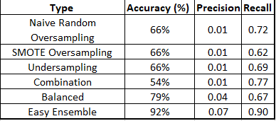

# credit_risk_analysis

## Overview

This analysis is based on loan data to predict if a loan would be considered high-risk or low-risk for the bank. To do so, we used the imblearn and sklearn libraries from python to construct different machine learning models. 

## Results

As you can see below, here are the results of each machine learning models we did. We evaluated them on their accuracy, precision and recall. 

## Summary

Based on the results seen in the table above, we would recommend the Easy Ensemble AdaBoost Model. This is the one who got the better scores all over the board. 
